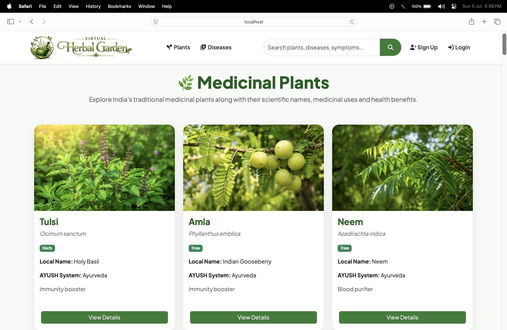
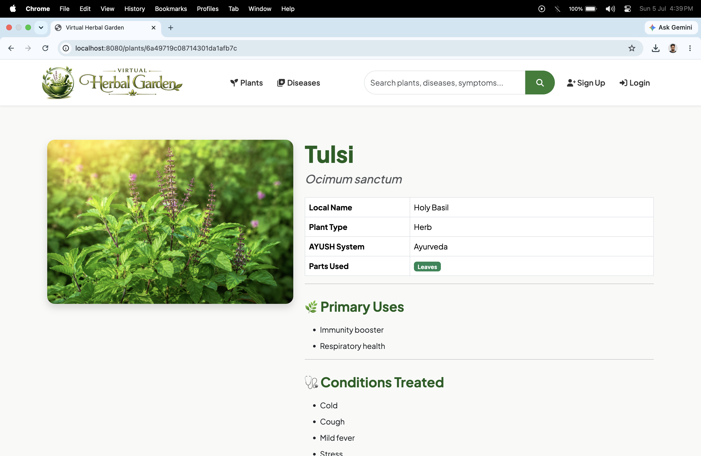
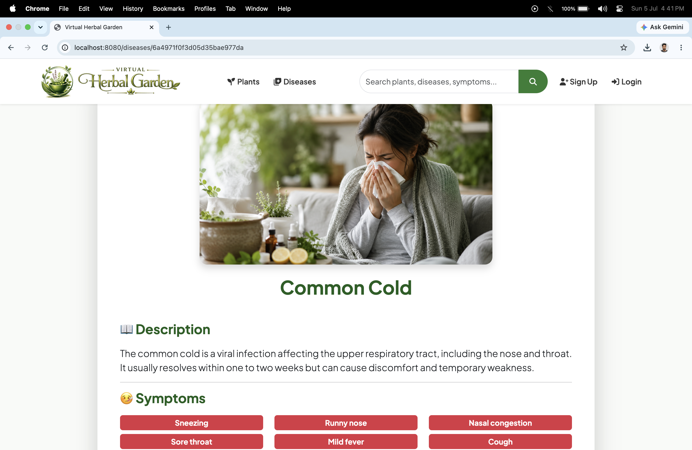
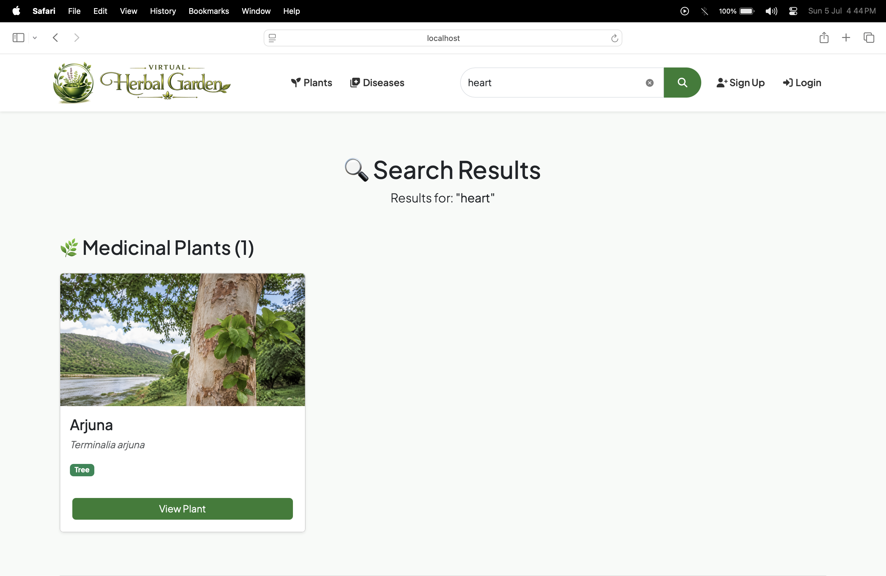
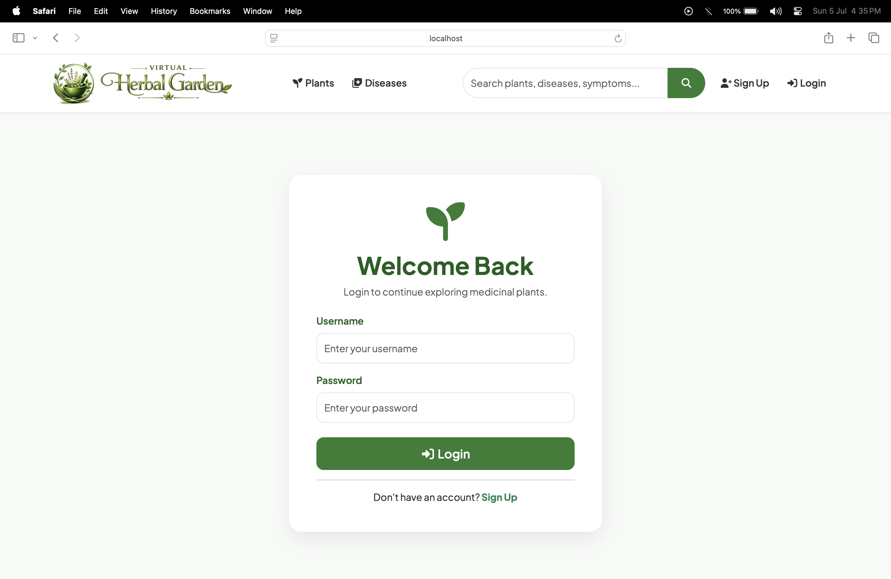
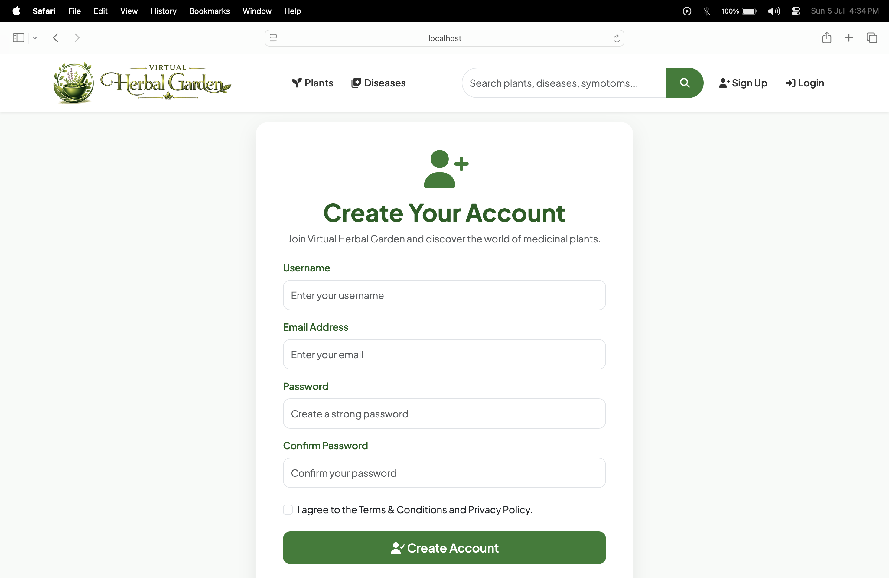

<div align="center">

# 🌿 Virtual Herbal Garden

### Version 1.0

### Preserving India's Medicinal Plant Heritage Through Technology

A full-stack web application developed to digitally preserve and promote India's medicinal plant heritage by providing a centralized platform for exploring medicinal plants, disease-wise herbal remedies, and traditional AYUSH knowledge through a secure, responsive, and user-friendly interface.

<br>


<br>


</div>

---
## 📖 Introduction

**Virtual Herbal Garden** is a full-stack web application developed to digitally preserve and promote India's rich medicinal plant heritage through modern web technologies. The platform provides a centralized and interactive environment where users can explore medicinal plants, understand their therapeutic properties, discover disease-wise herbal remedies, and learn about traditional AYUSH systems including Ayurveda, Yoga & Naturopathy, Unani, Siddha, and Homeopathy.

The application combines a responsive user interface with secure authentication, role-based authorization, cloud-based image management, and an intelligent universal search system to provide a seamless learning experience. An integrated administrative dashboard enables authorized users to efficiently manage medicinal plant records, disease information, and user roles, making the platform both informative and easy to maintain.

The Virtual Herbal Garden aims to bridge the gap between traditional herbal knowledge and modern digital technology by making authentic medicinal plant information accessible through a secure, organized, and user-friendly web application.

---

# 📌 Project Overview

Virtual Herbal Garden is a full-stack web application built using the **Node.js, Express.js, MongoDB, and EJS** technology stack following the **Model–View–Controller (MVC)** architecture. It serves as an educational and informational platform that digitally preserves traditional medicinal plant knowledge while providing users with an intuitive interface for exploring medicinal plants, herbal remedies, and AYUSH-based healthcare practices.

The platform allows users to browse medicinal plants, study disease-wise herbal remedies, search information through a universal search system, and access comprehensive plant details including scientific classification, medicinal uses, preparation methods, precautions, dosage, and side effects. Secure authentication and role-based authorization ensure that only administrators can manage plant, disease, and user information through a dedicated Admin Dashboard.

With cloud-based image storage using Cloudinary, responsive design using Bootstrap 5, and secure user authentication using Passport.js, the application demonstrates the practical implementation of modern web development technologies while promoting awareness of India's traditional medicinal heritage.

---

# 🎯 Objectives

The primary objectives of the Virtual Herbal Garden are:

- Develop a centralized digital repository of medicinal plants and herbal remedies.
- Preserve and promote India's traditional AYUSH-based medicinal knowledge.
- Provide comprehensive disease-wise herbal remedy information.
- Enable users to search medicinal information through a universal search system.
- Implement secure user authentication and role-based authorization.
- Provide administrators with an efficient dashboard for managing plants, diseases, and users.
- Ensure secure cloud-based image storage using Cloudinary.
- Develop a responsive, interactive, and user-friendly web application.
- Demonstrate the practical implementation of full-stack web development using the MVC architecture.

---

# ✨ Features

## 🌿 Medicinal Plant Management

The application provides a comprehensive medicinal plant repository where users can explore detailed information about various medicinal plants used in traditional AYUSH systems.

### Key Features

- Browse medicinal plants through an attractive card-based interface.
- View comprehensive plant details.
- Explore featured medicinal plants on the homepage.
- Responsive plant listing with optimized images.

### Plant Information Includes

- Common Name
- Scientific Name
- Local Name
- Botanical Family
- Plant Category
- AYUSH System
- Medicinal Uses
- Preparation Methods
- Dosage Information
- Precautions
- Side Effects
- Plant Images

---

## 🩺 Disease Management

Users can explore various diseases and learn about their herbal remedies using medicinal plants.

### Key Features

- Browse disease information.
- View detailed disease descriptions.
- Learn disease-wise herbal remedies.
- Discover recommended medicinal plants.

### Disease Information Includes

- Disease Name
- Symptoms
- Causes
- Herbal Remedies
- Recommended Medicinal Plants
- Prevention Methods
- Disease Images

---

## 🔍 Universal Search

A powerful universal search system enables users to search across multiple collections using a single search bar.

### Search By

- Plant Name
- Scientific Name
- Local Name
- Disease Name
- Symptoms
- Medicinal Uses
- Plant Category
- AYUSH System

---

## 👤 User Authentication

The application implements secure authentication using **Passport.js** and **Express Session**.

### Features

- User Registration
- Secure Login
- User Logout
- Session Management
- Password Encryption
- Flash Messages
- Automatic Redirect After Login

---

## 👑 Admin Dashboard

A dedicated Admin Dashboard provides role-based administrative control over the application.

### Dashboard Features

- Dashboard Statistics
- User Management
- Manage Registered Users
- Promote Users to Administrator
- Remove Administrator Privileges
- Delete User Accounts
- Prevent Self-Demotion
- Prevent Self-Deletion
- SweetAlert2 Confirmation Dialogs

---

## 🔐 Role-Based Authorization (RBAC)

The application follows Role-Based Access Control to protect administrative functionalities.

### Administrator Privileges

- Add New Medicinal Plants
- Edit Plant Information
- Delete Plants
- Add New Diseases
- Edit Disease Information
- Delete Diseases
- Upload and Manage Images
- Manage User Roles
- Manage User Accounts

### User Privileges

- Browse Medicinal Plants
- Explore Diseases
- Search Information
- View Detailed Records

### Guest Access

- Access Home Page
- View Featured Plants & Diseases
- Login Required for Protected Resources

---

## ☁️ Cloud Image Management

Cloudinary is integrated for secure cloud-based image storage and optimization.

### Features

- Cloud Image Upload
- Optimized Image Delivery
- Secure Media Storage
- Automatic Image Management

---

## 📱 Responsive User Interface

The application is fully responsive and provides an optimized experience across different devices.

### Supported Devices

- Desktop
- Laptop
- Tablet
- Mobile Phones

Built using **Bootstrap 5**, **EJS**, **Custom CSS**, and **JavaScript** for a clean, modern, and responsive interface.

---## ☁️ Cloud Image Management

The application integrates **Cloudinary** for secure cloud-based image storage and management, ensuring optimized media delivery and efficient handling of plant and disease images.

### Features

- Secure Cloud Image Upload
- Cloud-Based Image Storage
- Automatic Image Optimization
- Fast Image Delivery
- Image Management using Multer & Cloudinary

---

## 🏠 Dynamic Homepage

The homepage is designed to provide users with an engaging overview of the platform and quick access to important information.

### Homepage Features

- Responsive Hero Section
- Animated Statistics Counter
- Featured Medicinal Plants
- Featured Diseases
- Plant Categories
- Universal Search Bar
- FAQ Section
- Responsive Footer
- Modern Card-Based Layout

---

## 📱 Responsive Design

The application is fully responsive and optimized for different screen sizes, ensuring a seamless experience across all devices.

### Supported Devices

- Desktop
- Laptop
- Tablet
- Mobile Phones

### Technologies Used

- Bootstrap 5
- Custom CSS
- Responsive Grid System
- Mobile-Friendly Navigation
- Flexible Card Layouts

---

# 📊 Project Statistics

- **Version:** 1.0
- **Architecture:** MVC (Model–View–Controller)
- **Authentication:** Passport.js
- **Database:** MongoDB
- **Cloud Storage:** Cloudinary
- **Responsive Design:** Bootstrap 5
- **Role-Based Access Control:** Implemented
- **Universal Search:** Implemented
- **Admin Dashboard:** Implemented

# 🛠️ Tech Stack

| Category | Technologies |
|----------|--------------|
| **Frontend** | HTML5, CSS3, Bootstrap 5, JavaScript, EJS, SweetAlert2 |
| **Backend** | Node.js, Express.js |
| **Database** | MongoDB, Mongoose |
| **Authentication & Authorization** | Passport.js, Passport Local, Express Session, Connect Flash |
| **Cloud Storage** | Cloudinary, Multer |
| **Architecture** | MVC (Model–View–Controller) |
| **Version Control** | Git, GitHub |
| **Development Tools** | Visual Studio Code, Postman |
| **Deployment Ready** | Render / Railway |

---# 📁 Project Structure

```text
Virtual-Herbal-Garden
│
├── controllers/
│   ├── admin.js
│   ├── disease.js
│   ├── plant.js
│   ├── search.js
│   └── user.js
│
├── middleware/
│   └── index.js
│
├── models/
│   ├── disease.js
│   ├── plant.js
│   └── user.js
│
├── public/
│   ├── css/
│   ├── js/
│   └── images/
│
├── routes/
│   ├── admin.js
│   ├── disease.js
│   ├── plant.js
│   ├── search.js
│   └── user.js
│
├── utils/
│   ├── ExpressError.js
│   └── wrapAsync.js
│
├── views/
│   ├── admin/
│   ├── diseases/
│   ├── layouts/
│   ├── includes/
│   ├── plants/
│   ├── search/
│   ├── users/
│   └── home.ejs
│
├── app.js
├── cloudConfig.js
├── middleware.js
├── schema.js
├── package.json
├── package-lock.json
├── .env
└── README.md
```

---

# 🚀 Installation & Setup

Follow the steps below to set up and run the project locally.

## 📋 Prerequisites

Before running the application, ensure you have the following installed:

- Node.js (v18 or above recommended)
- MongoDB Atlas account or Local MongoDB
- Cloudinary account
- Git

---

## 📥 Clone the Repository

```bash
git clone https://github.com/mdfahim10/virtual-herbal-garden.git
```

Navigate to the project directory.

```bash
cd virtual-herbal-garden
```

---

## 📦 Install Dependencies

Install all required packages using npm.

```bash
npm install
```

---

## ⚙️ Configure Environment Variables

Create a `.env` file in the project root directory and add the following configuration:

```env
ATLASDB_URL=your_mongodb_connection_string

SECRET=your_session_secret

CLOUD_NAME=your_cloudinary_cloud_name

CLOUD_API_KEY=your_cloudinary_api_key

CLOUD_API_SECRET=your_cloudinary_api_secret
```

---

## ▶️ Run the Application

Start the development server.

Using npm:

```bash
npm start
```

Or using Nodemon:

```bash
nodemon app.js
```

---

## 🌐 Access the Application

Once the server starts successfully, open your browser and visit:

```text
http://localhost:8080
```

You should now be able to explore the Virtual Herbal Garden application.

---

## 👤 Default Access

After launching the application:

- Create a new user account using the **Sign Up** page.
- Log in to access protected resources.
- Administrator privileges can be assigned through the **Admin Dashboard** by an existing administrator.

---# 📸 Application Screenshots

The following screenshots demonstrate the key features and user interface of the Virtual Herbal Garden application.

## 🏠 Home Page


---

## 🌿 Medicinal Plants



---

## 🌱 Plant Details



---

## 🩺 Diseases


---

## 📖 Disease Details



---

## 🔍 Universal Search



---

## 🔐 User Authentication

### Login



### Registration



---

## 👑 Admin Dashboard *(Version 1.0)*

> *Recommended: Add screenshots after taking them.*

### Dashboard

```text
screenshots/admin-dashboard.png
```

### User Management

```text
screenshots/manage-users.png
```

---

# 🚀 Future Enhancements (Version 2.0)

The following features are planned for future releases of the Virtual Herbal Garden project:

- 🔔 Notification Center
- 📜 User Activity Logs
- ❤️ Favorite Medicinal Plants
- 👤 User Profile Management
- 🔑 Change Password
- 🤖 AI-powered Herbal Recommendation System
- 🌿 Plant Identification using Image Recognition
- 🌍 Multi-language Support
- 🌙 Dark Mode
- 📱 Progressive Web Application (PWA)
- 📲 Mobile Application (Android & iOS)
- 📄 PDF Export of Plant Information
- 🌐 REST API for Third-Party Integration
- ⚛️ React.js Frontend

---

# 🎓 Learning Outcomes

The development of this project provided practical experience in the following areas:

- Full-Stack Web Development
- MVC (Model–View–Controller) Architecture
- RESTful Routing
- MongoDB Database Design
- Authentication & Authorization using Passport.js
- Role-Based Access Control (RBAC)
- Session Management
- Cloudinary Image Integration
- CRUD Operations
- Express Middleware
- Server-Side Rendering using EJS
- Responsive UI Development with Bootstrap 5
- SweetAlert2 Integration
- Git & GitHub Version Control
- Software Project Management

---

# 🤝 Contributing

Contributions, suggestions, and improvements are welcome.

If you would like to contribute:

1. Fork the repository.
2. Create a new feature branch.
3. Commit your changes.
4. Push the branch.
5. Open a Pull Request.

---

# 👨‍💻 Developer

**Md Fahim**

**Full Stack Web Developer**

📧 **Email:** mdfahim002003@gmail.com

🔗 **LinkedIn:** https://www.linkedin.com/in/md-fahim-dev/

💻 **GitHub:** https://github.com/mdfahim10

---

# 📜 License

This project is developed for **educational, research, and portfolio purposes**.

---

# 🙏 Acknowledgements

Special thanks to the open-source technologies and communities that contributed to the development of this project.

- Node.js
- Express.js
- MongoDB
- Mongoose
- Passport.js
- Bootstrap 5
- Cloudinary
- SweetAlert2
- Font Awesome
- EJS
- Git & GitHub

---

# 📈 Project Status

## ✅ Version 1.0 Released

Virtual Herbal Garden Version 1.0 has been successfully completed with all core functionalities, including authentication, role-based authorization, medicinal plant management, disease management, universal search, cloud-based image management, responsive user interface, and an administrative dashboard for user, plant, and disease management.

Future enhancements and additional features will be introduced in **Version 2.0**.

---

⭐ **If you found this project useful, consider giving it a star on GitHub!**